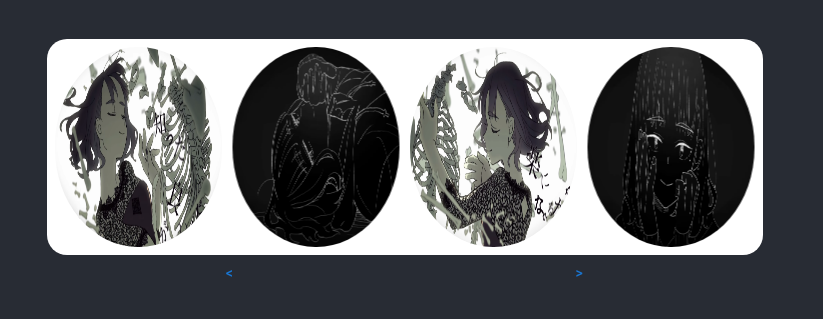

# Carousel Component w/ Material UI Library

For some reason this kind of image gallery isn't included in most component frameworks. This is a simple horizontal image gallery with left and right controls that moves between images while displaying a variable amount of images at once.

If you know of a way to improve this component please submit an issue. I am always happy to learn how to do things better. 

#### Implementation
Using Framer Motion you can animate the movement of an element by providing a different X position. As a result there is a significant amount of calculations to figure out where the absolute position of images are, requiring raw numbers as opposed to strings for certain parameters. 

Positions are set based on the width and gap and each image is mapped to one of these set positions. This avoids floating point errors of repeatedly calculating the position on the go. Controls change a reference starting index that is used to map the position of each image. 

The opacity is set to 0 for the 0th and n-1th image after considering the starting index. This animation completes on the first and last image position in order to avoid displaying the movement across the gallery when first moves to last position or vice versa.  



##### Props
Extends DefaultComponentProps for MUI's Box component so should work for most of MUI's API. Component specific APIs are as follows:

* width
    Defaulted to 300px. Passed only as a number due to internal calculations.
* height 
    Defaulted to 100px. Passed only as a number for consistency with width.
* gap
    Defaulted to 10px. Passed only as a number due to internal calculations. Is the spacing between images in the gallery. 
* contents 
    An array of image sources. By default (currently only option) n-2 images are displayed with the first and last images hidden. Is implemented as follows: 
    ```ts
      
    ```
* innerBorderRadius 
    The border radius of each image in the gallery. Default to 50% making each image round.

##### Tools
React, Framer Motion, Material UI

###### Todo
* Examples of different ways to use component 
* More control over how many images are hidden
* More control over the controls
* Indicator of additional images
* Faux 3D effect
* Better example (more detailed screenshot, animated, demo)
* Publish to bit dev

##### Credit 
Sample images sourced from [Otome Dissection](https://www.youtube.com/watch?v=7zwCIz-Ohn4) MV